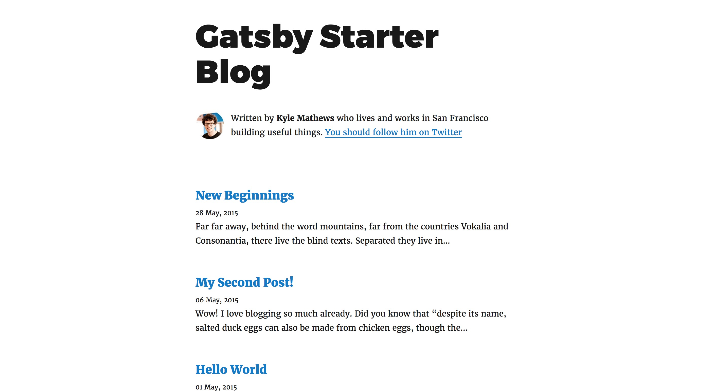
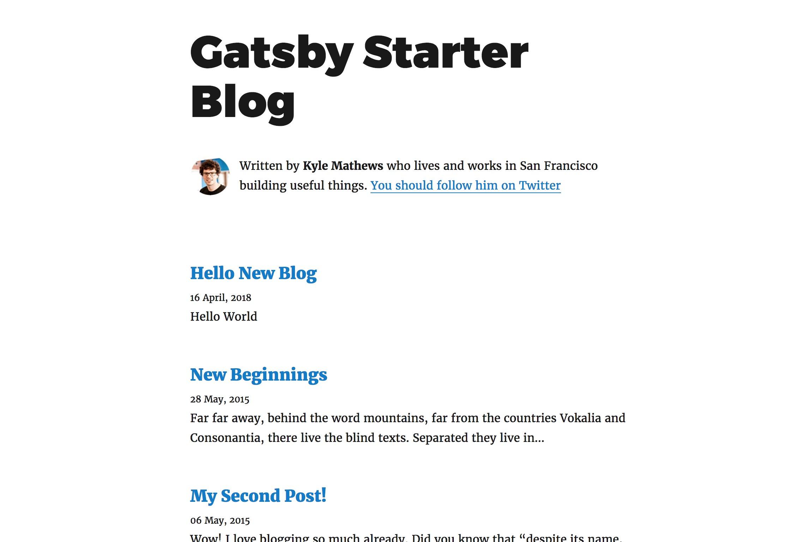

Recently I decided to start a blog using [Gatsby](https://www.gatsbyjs.org/) and migrate my old blogs to it.

There are lots of advantages to write on public platforms like [Medium](https://medium.com) over static site generators. If you write in public platforms , you can write on laptop, and edit on your phone, once you finished writing, you just need to click "Publish" button, everything is done and your blog is live. On the other hand, if you write a blog in static site generator, you will need to remember all the scripts, preview blog on `localhost`, build the blog for production, push your changes to GitHub and deploy your site publicly. If anything goes wrong, you might have to repeat a few steps and wait a few minutes until the blog online is what you want.

You will end up spend much more time doing unimportant things other than actual writing.

I guess this is why people eventually give up writing on static site and just write on Medium, but it is also very important to keep your writings in a secure place, just like you keep your diary books for years. Just imagine that one day you will need to migrate everything you wrote from Medium to somewhere else, that is when you hope you have wrote everything in Markdown initially and have a site hosting those Markdown files.

It is still true that the easier you can write and publish a blog, the more you will write. After trying to make writing simple using Gatsby and some additional setups, and I am pretty happy with the result.

**Gatsby** is a blazing fast static site generator based on ReactJS.

This post will be divided into five sections:

1.  **Create a Gatsby blog**
1.  **Setup Github Pages to host your blog**
1.  **Setup Travis for Automatic Deployment**
1.  **Add a new blog and publish**
1.  **Bonus: Write blog from your Phone**

## 1. Create a Gatsby blog

There are [plenty](https://scotch.io/tutorials/zero-to-deploy-a-practical-guide-to-static-sites-with-gatsbyjs) of [tutorials](https://www.gatsbyjs.org/tutorial/) on how to setup a blog using Gatsby, this blog will not be focusing on the Gatsby features, but mainly the setup.

```sh
$ yarn global add gatsby-cli
$ gatsby new gatsby-blog https://github.com/gatsbyjs/gatsby-starter-blog
$ cd gatsby-blog
$ gatsby develop
```

Now open `localhost:8000` and you should see the generated blog in your browser.



## 2. Setup Github Pages to host your blog

There are plenty of options to host your site for free, since I put my source code in GitHub, hosting my site on GitHub page will help me to keep everything in a single place, but feel free if you want to host your website somewhere else, the following steps still apply. Later I will need to use [Travis](https://travis-ci.org/) to automatically deploy website after I push a commit, so you might also need to [check which platforms they support](https://docs.travis-ci.com/user/deployment/) for deployment.

Now create a repo named _username.github.io_, this will be the repo of both your source code of your site and the production code.

Because GitHub page build from `master` branch, where you should deploy the `public` folder generated by `yarn build` command. We will need to put our source code into another branch, we call it `develop`.

```sh
$ git init
$ git add .
$ git commit -m "Initial Commit"
$ git checkout -b develop
$ git branch -d master
```

Here we just created `develop` and removed `master` branch locally, and we will work on `develop` branch from now on.

Now we need to push our code into GitHub.

```sh
$ git remote add origin git@github.com:username/username.github.io.git
$ git push -u origin develop
```

Make sure there is no `master` branch in your GitHub repo and `develop` branch is set to default.

## 3. Setup Travis for automatic deployment

This is an important step, although we can use `yarn deploy` to deploy, that is another 3 steps: Generate public folder, deploy to GitHub Page, wait and check online.

And we are able to get rid of those steps with [Travis](https://travis-ci.org/). Travis is free if your project is open sourced, to setup, create a Travis account by connect with your GitHub and add your site repo in Travis.

### Create a `travis.yml` file in repo

```yaml
language: node_js
cache:
  directories:
    - ~/.npm
notifications:
  email:
    recipients:
      - chen@huchen.me # Modify here to your own email
    on_success: always
    on_failure: always
node_js:
  - '9'
git:
  depth: 3
script:
  - yarn build # Modify here if your build script is different
branches:
  only:
    - develop
deploy:
  provider: pages
  skip-cleanup: true
  keep-history: true
  github-token: $GITHUB_TOKEN
  local-dir: public
  target-branch: master
  on:
    branch: develop
```

Let me explain this in details:

* It asked Travis to send me an email on both success and failed build, by default it only send email if status changed (was success but new change failed, or was failed and new changes fixed the build), I want to receive email even if it is success so I could double check online.
* It asked Travis to use Node `9`.
* It asked Travis to use depth `3` when cloning to save time.
* The script Travis need to run is `yarn build`, which create static files in `public` folder.
* It asked Travis to only trigger build on `develop` branch, if I push something on another branch, it won't build and deploy.
* It asked Travis to deploy to GitHub Pages after `yarn build` script success, it use `$GITHUB_TOKEN` I set in Travis repo setting (I will come to this next), publish contents in `public` folder into `master` branch, and it only should trigger on `develop` branch.

### Create a token for Travis

You’ll need to generate a [personal access token](https://help.github.com/articles/creating-an-access-token-for-command-line-use/) with the `public_repo` or `repo` scope (repo is required for private repositories) to allow Travis to push code to our GitHub repo (because Travis generate production code and need to push those code into `master` branch where GitHub Pages is serving).


Once token is created, you will need to **copy and paste it** in your Travis repo settings.

Now add your `.travis.yml` file in git and push to GitHub.

```sh
$ git add .travis.yml
$ git commit -m "Add Travis config file"
$ git push origin develop
```

Now you can check the status on Travis, if everything is ok, you should receive an email about the successful build and visit `https://username.github.io` to view your site live.

## 4. Add a new blog and publish

Here comes the fun part, now I will demonstrate how easy it is to publish a new blog using current process.

Now let's add a new blog.

1.  Create a file `index.md` in `src/pages/new-blog`, you will need to create a new folder `new-blog` for the new blog as well.
2.  Put some simple content in `index.md`.

```md
---
title: Hello New Blog
date: "2018-04-16T23:46:37.121Z"
---

Hello World
```

3.  Commit this new file and push into GitHub
4.  Wait for Travis to finish and check online. After you receive an email a few minutes later, now if you check `https://username.github.io` again, you should see your new blog in the list.



## 5. Bonus: Write blog from your phone

I want to remove another barrier of writing blog. I was only able to write blog when I am using my laptop, but if I can use my phone to craft ideas and edit my blog, there is nothing hold me back from writing on my own website.

It turned out to be pretty easy, all you need to do is to [add your Desktop and Documents files to iCloud Drive](https://support.apple.com/en-sg/HT206985) and put your repo either in Desktop or Documents. It may take sometime initially, but once everything is uploaded, the updates is instant and I can view my edits in my laptop, my iPhone and iPad at the same time without any issue.

There are plenty of markdown apps on iPhone, personally I find [IA Writer](https://ia.net/writer) is the best: it supports all platforms; I love write on it, it is elegant; it supports iCloud Drive very well.

Although I can also setup my iPhone to do git commits and pushes, I feel it is not necessary. If the most difficult part of writing a blog is already done, using laptop to do the final checking and commit the code is not a big issue for me, `git push` is just as simple as clicking the "Publish" button on Medium.

## Conclusion

We have come to the end of this tutorial. Thank you for reading this far.

This post is just the tip of iceberg of Gatsby's features, I am really amazed with how flexible and powerful it is. You should definitely checkout its [official tutorial](https://www.gatsbyjs.org/tutorial/).

You can grab the source code of my blog [here](https://github.com/huchenme/huchenme.github.io).
